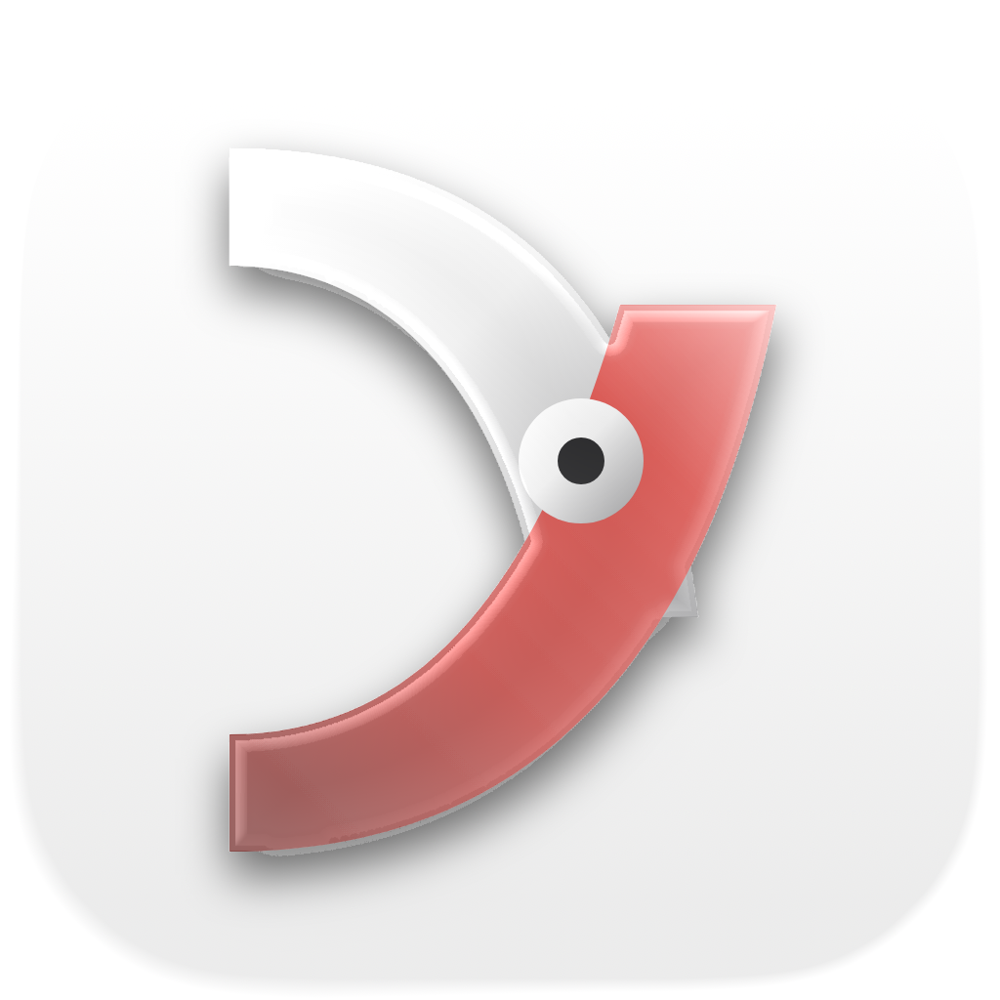
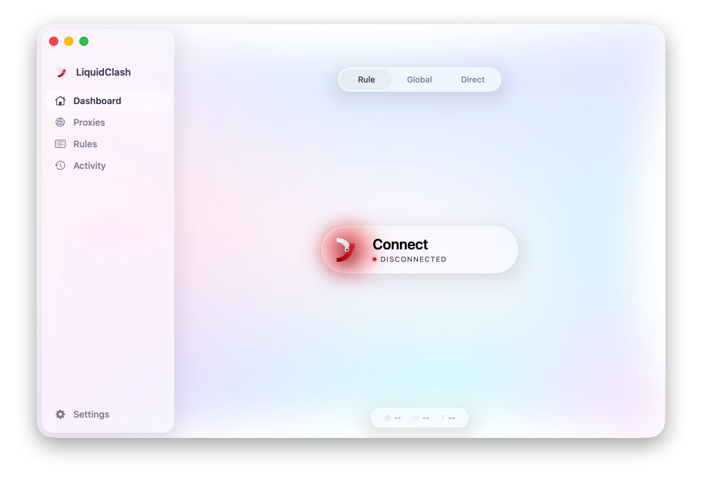
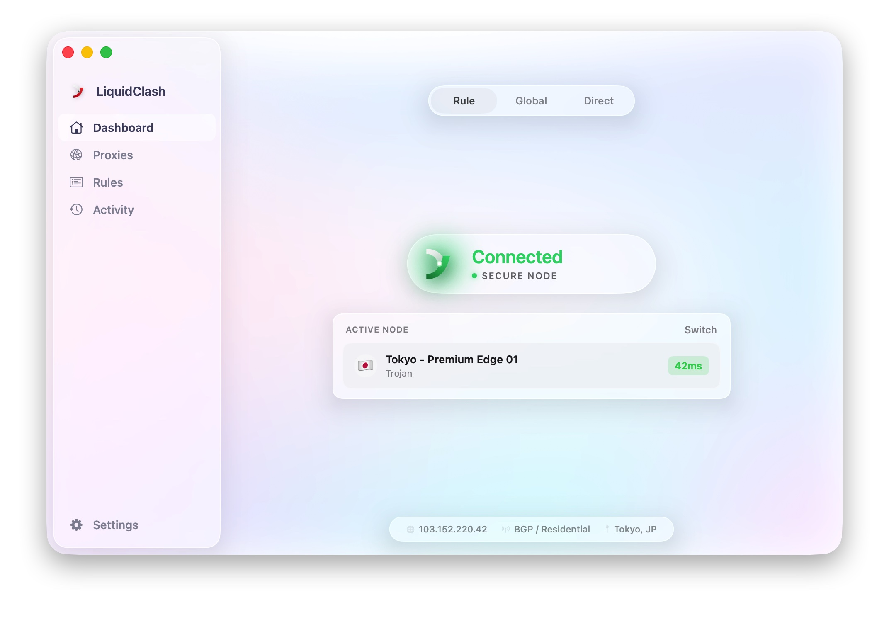
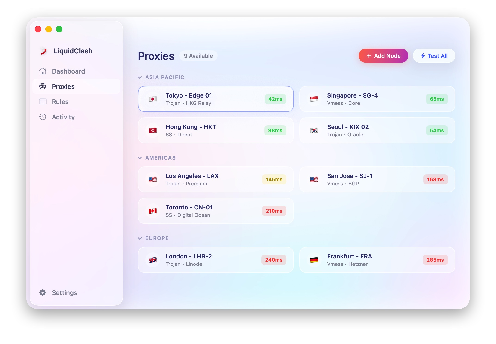
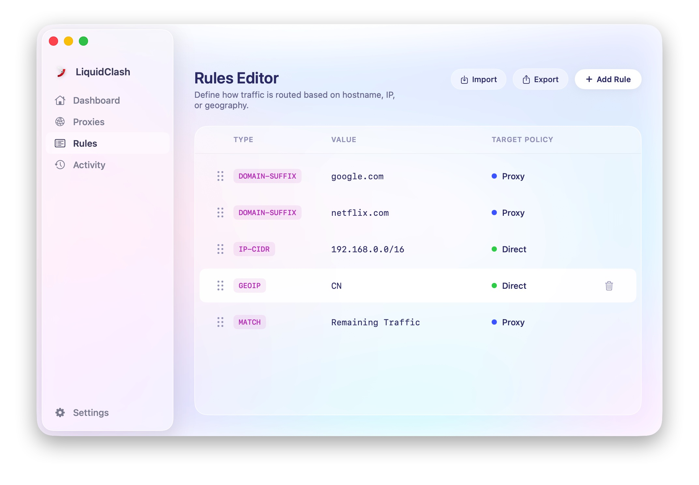
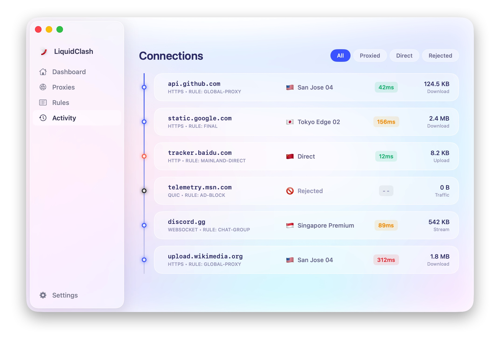
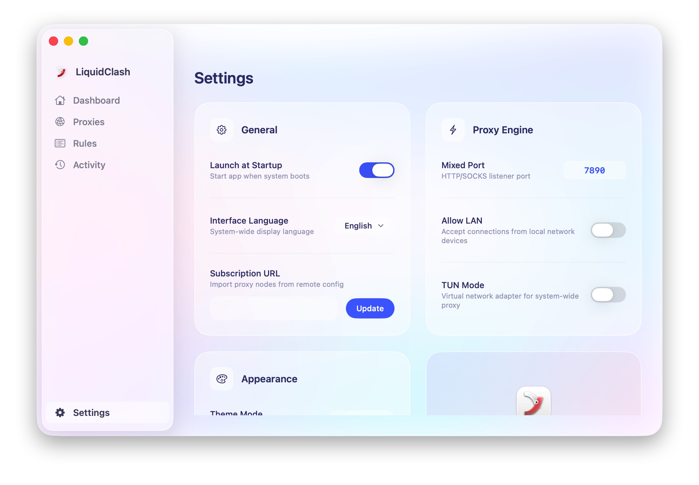

<p align="center">
  
</p>

<h1 align="center">LiquidClash</h1>

<p align="center">
  <strong>A modern Clash proxy client for macOS, built with native SwiftUI and Liquid Glass design.</strong>
</p>

<p align="center">
  
  
  
  
  
</p>

---

## Features

- **100% Native SwiftUI** — No Electron, no WebView. Pure Swift, pure performance.
- **Liquid Glass Design** — Embraces macOS 26's new Liquid Glass design language with translucent materials, mesh gradient backgrounds, and glass-morphism effects.
- **Latest Clash Core** — Powered by Clash Premium / mihomo core with full protocol support (Trojan, VMess, Shadowsocks, SOCKS5, HTTP).
- **Intuitive Interface** — Clean 5-page layout: Dashboard, Proxies, Rules, Activity, Settings.

## Screenshots

| Dashboard | Dashboard (Connected) |
|:---------:|:--------------------:|
|  |  |

| Proxies | Rules |
|:-------:|:-----:|
|  |  |

| Activity | Settings |
|:--------:|:--------:|
|  |  |

## Tech Stack

| Layer | Technology |
|-------|-----------|
| UI Framework | SwiftUI (macOS 26+) |
| Design System | Liquid Glass (`GlassEffect`, `MeshGradient`) |
| Language | Swift 6.2 |
| Proxy Core | Clash Premium / mihomo |
| Architecture | MVVM with `@State` / `@AppStorage` |
| Min Deployment | macOS 26.0 |

## Pages

### Dashboard
One-click connect/disconnect with animated pill button. Proxy mode selector (Rule / Global / Direct), active node card with latency display, and network info bar.

### Proxies
Region-grouped proxy node list with search and filtering. Expandable region sections with 2-column grid layout. Per-node latency badges (green/yellow/red). Add Node dialog for manual configuration.

### Rules
Table-based rule editor with drag-reorder handles. Support for DOMAIN-SUFFIX, IP-CIDR, GEOIP, MATCH and more. Color-coded policy indicators (Proxy/Direct/Reject). Import/Export functionality.

### Activity
Real-time connection log with timeline visualization. Filter by connection type (All/Proxied/Direct/Rejected). Per-connection latency and data transfer stats.

### Settings
Four settings cards in a 2×2 grid layout:
- **General** — Launch at startup, language, subscription URL
- **Proxy Engine** — Mixed port, Allow LAN, TUN mode
- **Appearance** — Theme mode, glass transparency, liquid animation
- **About** — Version info, auto-update, links

## Getting Started

### Requirements

- macOS 26.0 or later
- Xcode 26.0 or later

### Build

```bash
git clone https://github.com/liquidclash/liquidclash.git
cd liquidclash
open LiquidClash.xcodeproj
```

Build and run with `⌘R` in Xcode.

## Project Structure

```
LiquidClash/
├── LiquidClashApp.swift          # App entry point with onboarding flow
├── ContentView.swift             # Main layout with NavigationSplitView
├── Models/
│   └── MockData.swift            # Data models and mock data
├── Views/
│   ├── WelcomeView.swift         # First-launch onboarding
│   ├── DashboardView.swift       # Dashboard page
│   ├── ProxiesView.swift         # Proxies page
│   ├── RulesView.swift           # Rules editor page
│   ├── ActivityView.swift        # Connection log page
│   ├── SettingsView.swift        # Settings page
│   ├── SidebarView.swift         # Navigation sidebar
│   ├── MeshGradientBackground.swift  # Animated background
│   └── ...                       # Component views
├── Assets.xcassets/              # App icons and image assets
└── design/                       # HTML design mockups
```

## License

MIT License. See [LICENSE](LICENSE) for details.

---

<p align="center">
  Built with SwiftUI & Liquid Glass
</p>
