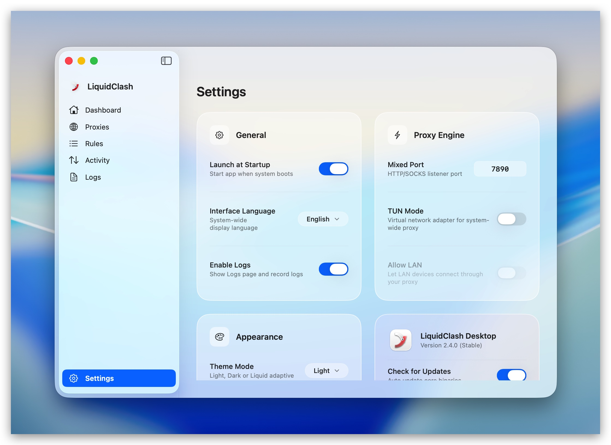

<p align="center">
  
</p>

<h1 align="center">LiquidClash</h1>

<p align="center">
  <strong>The first Clash client designed for Liquid Glass.</strong>
</p>

<p align="center">
  A modern, fully native macOS proxy client — built with SwiftUI from the ground up.
</p>

<p align="center">
  <a href="https://github.com/liquidclash/liquidclash/releases/latest"></a>
  
  
  
  
  
</p>

<p align="center">
  <a href="https://github.com/liquidclash/liquidclash/releases/latest"><strong>📥 Download Latest Release</strong></a>
</p>

---

<p align="center">
  
</p>

## Features

- 🖥️ **100% Native SwiftUI** — No Electron, no WebView. Pure Swift performance with zero overhead.
- 🪟 **Liquid Glass Design** — Translucent materials, mesh gradients, and glass-morphism effects that feel right at home on macOS 26.
- ⚡ **Full Protocol Support** — Powered by mihomo core: Trojan, VMess, Shadowsocks, SOCKS5, HTTP, Hysteria2, VLESS.
- 📋 **Smart Subscriptions** — Multi-source management, one-click update, file import, and Clash Verge profile migration.
- 🌐 **System Proxy & TUN** — System-wide proxy with TUN mode and LAN sharing.
- 📊 **Real-time Monitoring** — Live connection logs, latency tracking, and proxy core log viewer.
- 🔤 **Multi-language** — English, 简体中文, 日本語.

## Why LiquidClash?

Most Clash clients are built with Electron or WebView — they work, but they don't feel like Mac apps. LiquidClash is different: **every pixel is native SwiftUI**, designed specifically for macOS 26's Liquid Glass aesthetic. The result is a proxy client that's fast, lightweight, and looks like it belongs on your Mac.

## Screenshots

| Proxies | Settings |
|:-------:|:--------:|
|  |  |

## Install

### Download (Recommended)

Download the latest DMG from [Releases](https://github.com/liquidclash/liquidclash/releases/latest), open it and drag `LiquidClash.app` to Applications.

### Build from Source

```bash
git clone https://github.com/liquidclash/liquidclash.git
cd liquidclash
open LiquidClash.xcodeproj
```

Build and run with `⌘R` in Xcode. Requires macOS 26.0+ and Xcode 26.0+.

## Tech Stack

| Layer | Technology |
|-------|-----------|
| UI Framework | SwiftUI (macOS 26+) |
| Design System | Liquid Glass (`GlassEffect`, `MeshGradient`) |
| Language | Swift 6.2 |
| Proxy Core | mihomo (Clash Premium) |
| Protocols | Trojan, VMess, SS, SOCKS5, HTTP, Hysteria2, VLESS |
| Architecture | MVVM with `@Observable` / `@AppStorage` |

## Contributing

See [CONTRIBUTING.md](CONTRIBUTING.md) for project structure and build instructions.

## License

MIT License. See [LICENSE](LICENSE) for details.

---

<p align="center">
  Crafted for macOS. No compromises.
</p>
