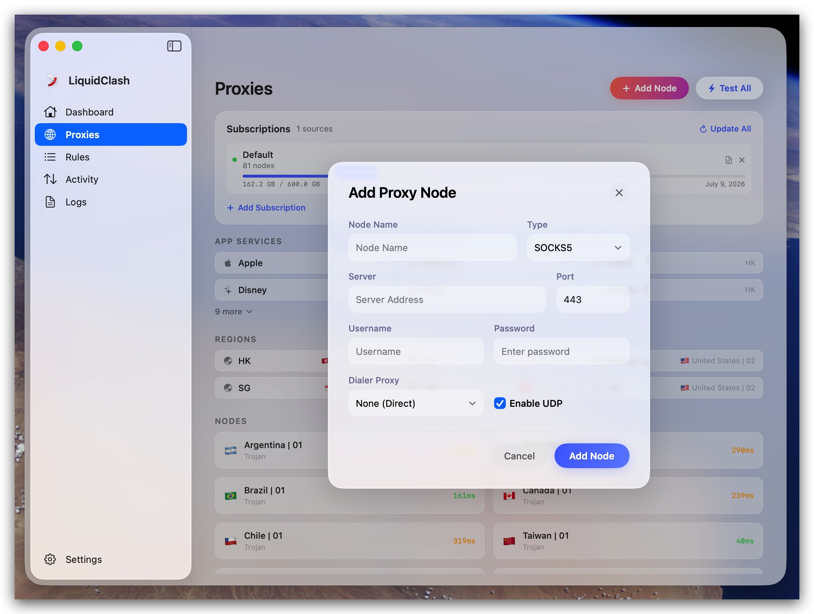

<p align="center">
  
</p>

<h1 align="center">LiquidClash</h1>

<p align="center">
  <strong>A modern Clash proxy client for macOS, built with native SwiftUI and Liquid Glass design.</strong>
</p>

<p align="center">
  <a href="https://github.com/liquidclash/liquidclash/releases/latest"></a>
  
  
  
  
  
</p>

<p align="center">
  <a href="https://github.com/liquidclash/liquidclash/releases/latest"><strong>Download DMG</strong></a>
</p>

---

## Features

- **100% Native SwiftUI** — No Electron, no WebView. Pure Swift, pure performance.
- **Liquid Glass Design** — Embraces macOS 26's Liquid Glass design language with translucent materials, mesh gradient backgrounds, and glass-morphism effects.
- **mihomo Core** — Powered by mihomo (Clash Premium) with full protocol support: Trojan, VMess, Shadowsocks, SOCKS5, HTTP, Hysteria2, VLESS.
- **Subscription Management** — Multi-source subscriptions with one-click update, file import, and Clash Verge profile import.
- **System Proxy & TUN** — System-wide proxy configuration with TUN mode support and LAN sharing.
- **Menu Bar Access** — Quick connect/disconnect and status overview from the menu bar.
- **Real-time Monitoring** — Live connection logs with filtering and proxy core log viewer.
- **Multi-language** — English, 简体中文, 日本語.

## Screenshots

| Dashboard | Proxies |
|:---------:|:-------:|
|  |  |

| Add Proxies | Rules |
|:-----------:|:-----:|
|  |  |

| Activity | Settings |
|:--------:|:--------:|
|  |  |

## Install

### Download (Recommended)

Download the latest DMG from [Releases](https://github.com/liquidclash/liquidclash/releases/latest), open it and drag `LiquidClash.app` to Applications.

### Build from Source

```bash
git clone https://github.com/liquidclash/liquidclash.git
cd liquidclash
open LiquidClash.xcodeproj
```

Build and run with `⌘R` in Xcode. Requires macOS 26.0+ and Xcode 26.0+.

## Pages

### Dashboard
One-click connect/disconnect with animated pill button. Proxy mode selector (Rule / Global / Direct), active node card with latency display, and network info bar.

### Proxies
Region-grouped proxy node list with search and filtering. Expandable region sections with 2-column grid layout. Per-node latency badges with color coding. Manual node addition and latency testing.

### Rules
Table-based rule editor with drag-reorder. Support for DOMAIN-SUFFIX, IP-CIDR, GEOIP, MATCH and more. Color-coded policy indicators (Proxy/Direct/Reject). Import/Export functionality.

### Activity
Real-time connection log with timeline visualization. Filter by connection type (All/Proxied/Direct/Rejected). Per-connection latency and data transfer stats.

### Logs
Live proxy core log viewer with filtering.

### Settings
- **General** — Launch at startup, language selection, log toggle
- **Proxy Engine** — Mixed port, Allow LAN, TUN mode
- **Appearance** — Theme (Light/Dark/Adaptive), glass transparency, blur intensity
- **About** — Version info, auto-update, links

## Tech Stack

| Layer | Technology |
|-------|-----------|
| UI Framework | SwiftUI (macOS 26+) |
| Design System | Liquid Glass (`GlassEffect`, `MeshGradient`) |
| Language | Swift 6.2 |
| Proxy Core | mihomo (Clash Premium) |
| Protocols | Trojan, VMess, SS, SOCKS5, HTTP, Hysteria2, VLESS |
| Architecture | MVVM with `@Observable` / `@AppStorage` |

## Project Structure

```
LiquidClash/
├── LiquidClashApp.swift              # App entry point with menu bar
├── ContentView.swift                 # Main layout with NavigationSplitView
├── Core/
│   ├── ClashAPI.swift                # Clash RESTful API client
│   ├── ClashManager.swift            # Core process lifecycle management
│   ├── ClashWebSocket.swift          # WebSocket for real-time updates
│   └── SystemProxy.swift             # macOS system proxy configuration
├── Models/
│   ├── AppSettings.swift             # User preferences model
│   ├── ClashConfig.swift             # Clash configuration model
│   ├── ProxyNode.swift               # Proxy node model
│   ├── ProxyGroup.swift              # Proxy group model
│   ├── RuleEntry.swift               # Rule entry model
│   ├── ConnectionLog.swift           # Connection log model
│   ├── LogEntry.swift                # Log entry model
│   └── MockData.swift                # Preview mock data
├── Services/
│   ├── AppState.swift                # Global app state management
│   ├── ConfigParser.swift            # YAML config parser
│   ├── ConfigStorage.swift           # Config persistence
│   └── SubscriptionManager.swift     # Subscription management
├── Views/
│   ├── DashboardView.swift           # Dashboard page
│   ├── ProxiesView.swift             # Proxies page
│   ├── RulesView.swift               # Rules editor page
│   ├── ActivityView.swift            # Connection log page
│   ├── LogsView.swift                # Core log page
│   ├── SettingsView.swift            # Settings page
│   ├── WelcomeView.swift             # First-launch onboarding
│   ├── MenuBarView.swift             # Menu bar popover
│   ├── SidebarView.swift             # Navigation sidebar
│   ├── MeshGradientBackground.swift  # Animated background
│   └── ...                           # Component views
├── Resources/
│   ├── mihomo                        # mihomo core binary
│   ├── country.mmdb                  # GeoIP database (MaxMind)
│   ├── geoip.dat                     # GeoIP rules
│   └── geosite.dat                   # GeoSite rules
└── Assets.xcassets/                  # App icons and image assets
```

## License

MIT License. See [LICENSE](LICENSE) for details.

---

<p align="center">
  Built with SwiftUI & Liquid Glass
</p>
